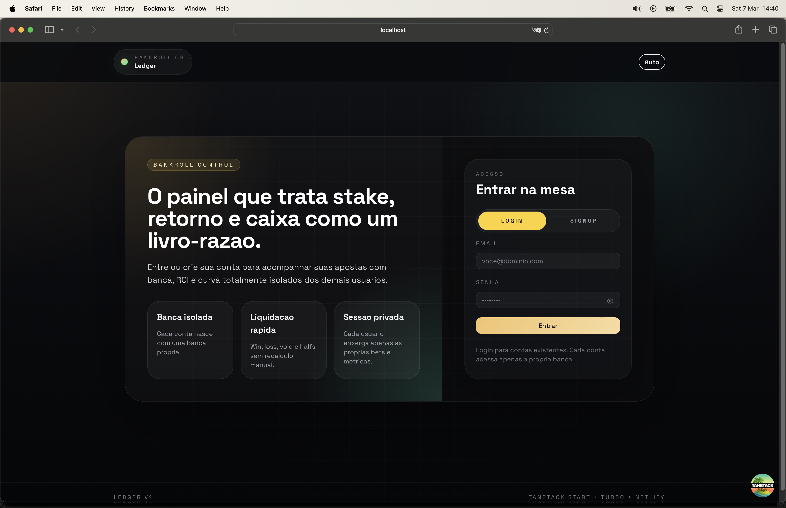

# Ledger

Sistema multi-user para registrar apostas, controlar banca e acompanhar retorno operacional por conta.



## O que o produto cobre

- signup e login com sessao por cookie HTTP-only
- uma `Banca Principal` criada automaticamente por usuario
- registro manual de bets com stake, odd, casa, mercado, selecao, tags e nota
- movimentacoes de banca via deposito, saque e ajuste
- liquidacao com `win`, `loss`, `void`, `cashout`, `half_win` e `half_loss`
- reabertura de bet liquidada sem apagar a entrada original
- dashboard com saldo atual, lucro, ROI, yield, win rate, streak e curva da banca
- isolamento de dados por usuario em todas as queries e mutations

## Stack

- `TanStack Start`
- `TanStack Router`
- `TanStack Query`
- `Turso / libSQL`
- `Drizzle ORM`
- `Netlify adapter`
- `Vitest`

## Fluxo principal

### Acesso

- `Login`: entra em uma conta existente
- `Signup`: cria um novo usuario e a banca principal com saldo inicial zero

### Book de bets

- `/bets/new`: cria uma nova entrada e desconta a stake da banca
- `/bets/$betId`: edita, liquida, reabre ou apaga a bet
- `/bets`: lista bets com filtros por status, esporte, casa e tag

### Banca

- `/bankroll`: registra deposito, saque e ajuste manual
- o saldo nunca e editado diretamente
- o saldo sempre vem de `initial_balance + soma(transacoes)`

## Regras de settlement

- `win`: retorno `stake * odd`
- `loss`: retorno `0`
- `void`: retorno `stake`
- `cashout`: retorno manual informado em BRL
- `half_win`: metade ganha, metade devolve
- `half_loss`: metade perde, metade devolve

## Multi-user

- cada usuario possui sessao propria
- cada usuario possui uma conta de banca propria
- bets, tags, transacoes e dashboard sao filtrados pela conta autenticada
- nao existe compartilhamento de dados entre usuarios

## Rodando localmente

```bash
pnpm install
pnpm db:generate
pnpm dev
```

Para criar uma conta inicial por script:

```bash
pnpm bootstrap:user
```

## Variaveis de ambiente

```bash
TURSO_DATABASE_URL="file:local.db"
TURSO_AUTH_TOKEN=""
SESSION_COOKIE_SECRET="dev-session-secret-1234"
BOOTSTRAP_EMAIL="owner@example.com"
BOOTSTRAP_PASSWORD="changeme123"
VITE_APP_TITLE="Ledger"
```

Observacoes:

- `BOOTSTRAP_EMAIL` e `BOOTSTRAP_PASSWORD` sao opcionais
- em ambiente local, `file:local.db` dispensa Turso remoto
- em producao, use a URL `libsql://...` e um token valido do Turso

## Scripts

```bash
pnpm dev
pnpm build
pnpm test
pnpm db:generate
pnpm db:push
pnpm bootstrap:user
```

## Stripe billing

Billing base already exists in the app:

- local entitlement mirror in `billing_subscriptions`
- hosted Stripe Checkout for `Pro` and `Pro+`
- Stripe Customer Portal launch from `Settings`
- webhook endpoint at `/api/stripe/webhook`

Required environment variables:

```bash
APP_URL="http://localhost:3000"
STRIPE_SECRET_KEY=""
STRIPE_WEBHOOK_SECRET=""
STRIPE_PRO_MONTHLY_PRICE_ID=""
STRIPE_PRO_YEARLY_PRICE_ID=""
STRIPE_PRO_PLUS_MONTHLY_PRICE_ID=""
STRIPE_PRO_PLUS_YEARLY_PRICE_ID=""
```

The fastest local webhook loop is with the Stripe CLI forwarding events to:

```bash
stripe listen --forward-to localhost:3000/api/stripe/webhook
```

## Estrutura relevante

- `src/lib/server-functions.ts`: server functions do app
- `src/lib/server/`: regras de auth, banca, bets e dashboard
- `src/db/schema.ts`: schema Drizzle
- `src/routes/`: rotas do produto

## Status

Pronto para desenvolvimento local, deploy em Netlify e uso multi-user basico com Turso.

## Strategy Docs

- `docs/strategy/landing-page-wireframe.md`
- `docs/strategy/pricing-and-billing.md`
- `docs/strategy/chrome-extension-architecture.md`
